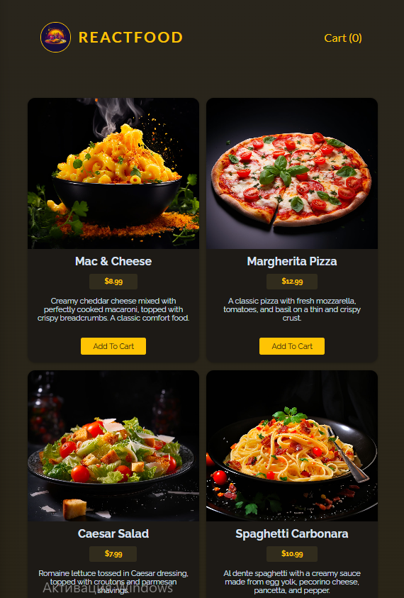
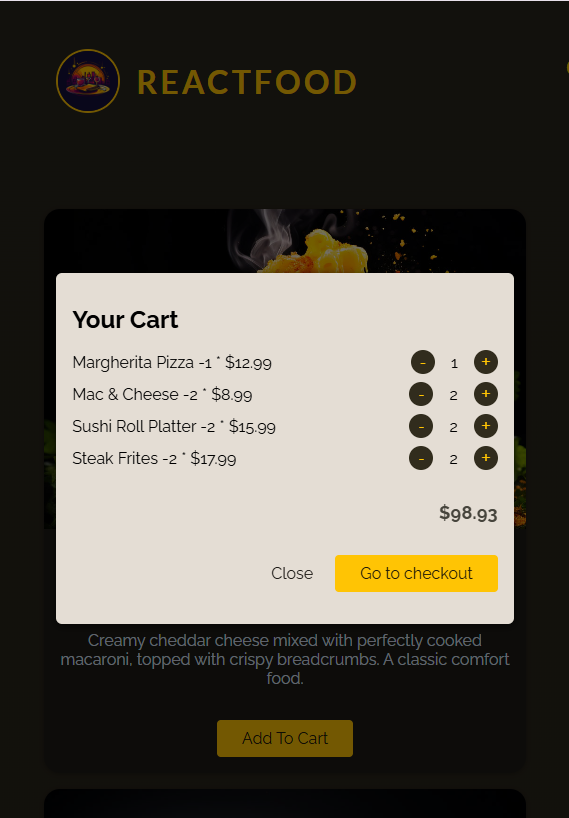
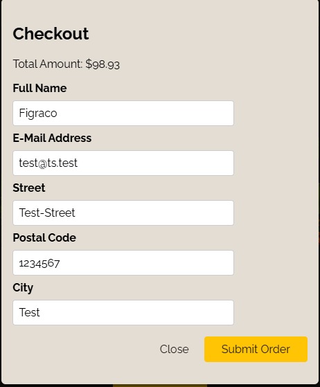
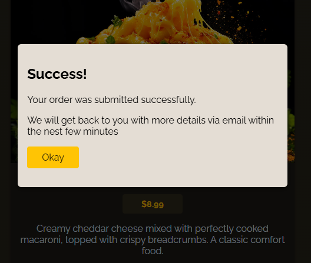

# 🍽️ ReactFood — Food Ordering Application

ReactFood is a **full-stack food ordering system** built with **React (frontend)** and **Node.js + Express (backend)**.  
It demonstrates **modern React hooks**, **custom context management**, and **asynchronous HTTP communication** using a custom hook (`useHttp`).

The project implements:
- fetching and displaying meals from a backend API,
- cart management using React Context + Reducer,
- checkout flow with form validation and order submission,
- persistent UI state management (cart and modal dialogs).

---

<h3 align="center">📸 Project Preview</h3>

<p align="center">
  <br/>
  <em>Main page with meals fetched from backend API</em>
</p>

<p align="center">
  <br/>
  <em>Cart modal displaying selected meals</em>
</p>

<p align="center">
  <br/>
  <em>Checkout form using React form actions and async request handling</em>
</p>

<p align="center">
  <br/>
  <em>Successful order confirmation modal</em>
</p>

---

## 🧩 Architecture Overview

<pre>
📁 project-root
├── backend/
│   ├── app.js                   # Express server with REST API endpoints
│   ├── data/
│   │   ├── available-meals.json # Static meal data for GET /meals
│   │   └── orders.json          # Saved orders from POST /orders
│   └── package.json             # Server dependencies (express, body-parser)
│
├── src/
│   ├── components/              # React UI Components
│   │   ├── Cart.jsx
│   │   ├── CartItem.jsx
│   │   ├── Checkout.jsx
│   │   ├── Header.jsx
│   │   ├── Meals.jsx
│   │   ├── MealItem.jsx
│   │   ├── UI/Modal.jsx
│   │   ├── UI/Button.jsx
│   │   └── UI/Input.jsx
│   │
│   ├── store/                   # React Context for app state
│   │   ├── CartContext.jsx
│   │   └── UserProgressContext.jsx
│   │
│   ├── hooks/
│   │   └── useHttp.js           # Custom hook for HTTP requests
│   │
│   ├── util/
│   │   └── formatting.js        # Currency formatter
│   │
│   ├── assets/                  # UI images and previews
│   └── App.jsx                  # Application root component
│
└── public/
    └── index.html
</pre>

---

## ⚙️ Backend Overview

**Stack:** Node.js, Express, body-parser, file I/O via `fs/promises`.

### Routes:
| Method | Endpoint | Description |
|--------|-----------|-------------|
| `GET`  | `/meals`  | Returns available meals from `available-meals.json` |
| `POST` | `/orders` | Validates and stores customer order in `orders.json` |

### Validation:
The server ensures that:
- all order items exist,
- user details (name, email, street, postal code, city) are non-empty,
- email contains `"@"`.

If validation fails, the backend returns a `400 Bad Request` with a descriptive message.

---

## ⚛️ Frontend Overview

Built with **React functional components**, **custom hooks**, and **React Context API**.  
The UI is fully modular and reactive — modal dialogs, input validation, and cart logic are independent but connected through shared context.

---

### 🧠 Core Hooks and Contexts

#### 1. `CartContext`
- Uses `useReducer` to manage cart state.
- Handles:
  - adding an item (`ADD_ITEM`)
  - removing an item (`REMOVE_ITEM`)
  - clearing the cart (`CLEAR_CART`)

This ensures centralized and predictable cart state updates.

#### 2. `UserProgressContext`
- Manages current UI state:
  - `""` — default
  - `"cart"` — when cart modal is open
  - `"checkout"` — during checkout
- Provides handlers `showCart`, `hideCart`, `showCheckout`, and `hideCheckout`.

#### 3. `useHttp`
Custom hook that handles all HTTP operations and encapsulates async logic.

```js
const { data, isLoading, error, sendRequest, clearData } = useHttp(url, config, initialData);
```
It provides:

- automatic **GET request** on mount if `method` is not defined  
- configurable **sendRequest** for `POST` / `PUT` / `DELETE`  
- automatic **error handling**  
- reusable **async loading state**

---

## 📦 Checkout Workflow

The checkout flow is controlled by **`useActionState`** — a React 19+ hook for handling async form submissions.

1. User fills out the checkout form.  
2. On submit, React passes the form data (`FormData`) into `checkoutAction`.  
3. The function:

```js
async function checkoutAction(prevState, fd) {
    const customerData = Object.fromEntries(fd.entries());
    await sendRequest(
        JSON.stringify({
            order: {
                items: cartCtx.items,
                customer: customerData,
            },
        })
    );
}
```

- collects **customer data**  
- serializes it to **JSON**  
- sends it to the **`/orders`** endpoint  
- on success — **confirmation modal** is displayed  

---

## 🧾 Key Features

- Dynamic meal rendering via **REST API** (`GET /meals`)  
- Context-based cart management (**no prop drilling**)  
- Reusable **UI components** (`Button`, `Input`, `Modal`)  
- Custom hook for all **HTTP requests** (`useHttp`)  
- Form submission using **useActionState** for clean async handling  
- **Error boundaries** and **loading indicators** for all API operations  
- Currency formatting via **Intl.NumberFormat**

---

## 🧱 Technologies Used

| **Category** | **Tools** |
|---------------|-----------|
| **Frontend** | React 19, JSX, Context API, useReducer, useActionState |
| **Backend** | Node.js, Express, Body-Parser, fs/promises |
| **Communication** | REST API (`GET /meals`, `POST /orders`) |
| **Formatting** | Intl.NumberFormat |
| **Styling** | CSS modules (not included here, but easily extendable) |
